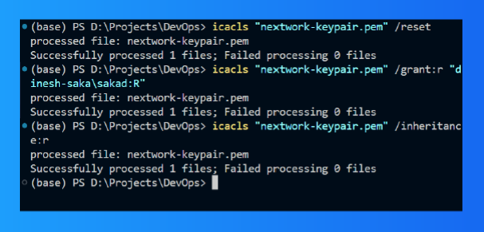

# Java Web Application Deployment on AWS EC2

This project demonstrates the setup and deployment of a Java web application on an AWS EC2 instance using Java, Maven, and SSH connections. Below are the detailed steps and components involved in the project.

## Project Overview
The goal of this project is to deploy a Java-based web application hosted on an AWS EC2 instance. Key steps include launching an EC2 instance, configuring secure access, setting up the development environment, and deploying the application.


---

## Project Steps

### 1. **Launching an EC2 Instance**
- **Purpose**: The EC2 instance acts as the host for the web application.
- **Setup**:
  - Select an appropriate Amazon Machine Image (AMI).
  - Configure security groups to allow SSH traffic only from your IP address.
  - Launch the instance using the appropriate instance type and storage.

---

### 2. **Configuring SSH Access**
- **What is SSH?**: Secure Shell (SSH) is a protocol for secure communication between a client and a remote server.
- **Steps**:
  - Generate a key pair (private and public keys) for authentication.
  - Save the `network-keypair.pem` file securely; it will be used to access the instance.

---

### 3. **Setting Up Visual Studio Code (VSCode)**
- **Purpose**: To create and edit application files directly on the EC2 instance.
- **Steps**:
  - Install VSCode and the Remote - SSH extension.
  - Configure the SSH extension with the instance's public IPv4 DNS and private key location.

---

### 4. **Updating our private key's permissions**
- We also updated our private key's permissions by running the `icacls` command. This was done to ensure that the private key file had the appropriate permissions set for security and access when connecting to the EC2 instance via SSH.
- **Command**:
  ```bash
  icacls "path/to/your/network-keypair.pem" /reset
  icacls "path/to/your/network-keypair.pem" /grant:r "%username%:R"
  icacls "path/to/your/network-keypair.pem" /inheritance:r
  ```


---

### 5. **Connecting to EC2 via SSH**
- **Command**: 
  ```bash
  ssh -i [PATH TO YOUR .PEM FILE] ec2-user@[YOUR PUBLIC IPV4 DNS]

#### Note
Replace `[PATH TO YOUR .PEM FILE]` and `[YOUR PUBLIC IPV4 DNS]` with your `.pem` file path and instance address.


---

### 6. Installing Maven and Java
- **Apache Maven**: A package manager for managing project dependencies and building the application.
``` bash
wget https://archive.apache.org/dist/maven/maven-3/3.5.2/binaries/apache-maven-3.5.2-bin.tar.gz

sudo tar -xzf apache-maven-3.5.2-bin.tar.gz -C /opt

echo "export PATH=/opt/apache-maven-3.5.2/bin:$PATH" >> ~/.bashrc

source ~/.bashrc
```
- **Java**: Required for running and developing the Java web application.
``` bash
sudo dnf install -y java-1.8.0-amazon-corretto-devel

export JAVA_HOME=/usr/lib/jvm/java-1.8.0-amazon-corretto.x86_64

export PATH=/usr/lib/jvm/java-1.8.0-amazon-corretto.x86_64/jre/bin/:$PATH
```
- Installed **Amazon Corretto 8**, a Java SE implementation optimized for AWS.

---

### 7. Creating the Java Web Application

#### Generating the Application:
Use the following Maven command to set up a basic web application structure:
```bash
mvn archetype:generate \
   -DgroupId=com.nextwork.app \
   -DartifactId=nextwork-web-project \
   -DarchetypeArtifactId=maven-archetype-webapp \
   -DinteractiveMode=false

```

#### File Structure
- `src`: Contains source code.
- `webapp`: A subfolder in `src` with user-facing files like `index.jsp`.

---

## Key Features:
- **Secure Access**: SSH configured to allow access only from your IP.
- **Remote Development**: VSCode with Remote-SSH for editing files directly on EC2.
- **Build Automation**: Maven for managing dependencies and building the application.
- **Custom Java Application**: A basic web app built with Maven archetype and customized using JSP files.

## Requirements
- **AWS EC2 instance** with proper configuration.
- **Maven and Java** installed on the EC2 instance.
- **SSH client** and `.pem` file for access.
- **VSCode** with Remote - SSH extension.

## Learnings
- Launching and configuring AWS EC2 instances.
- Securely accessing servers via SSH.
- Setting up a development environment on a remote server.
- Deploying a Java web application using Maven and JSP.
